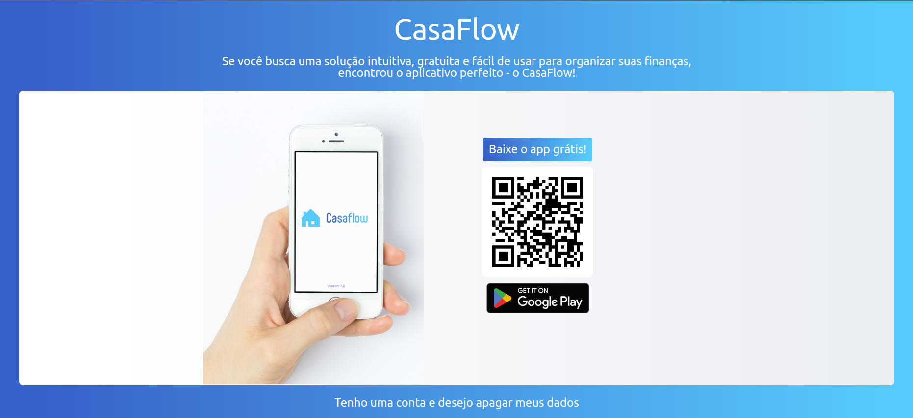
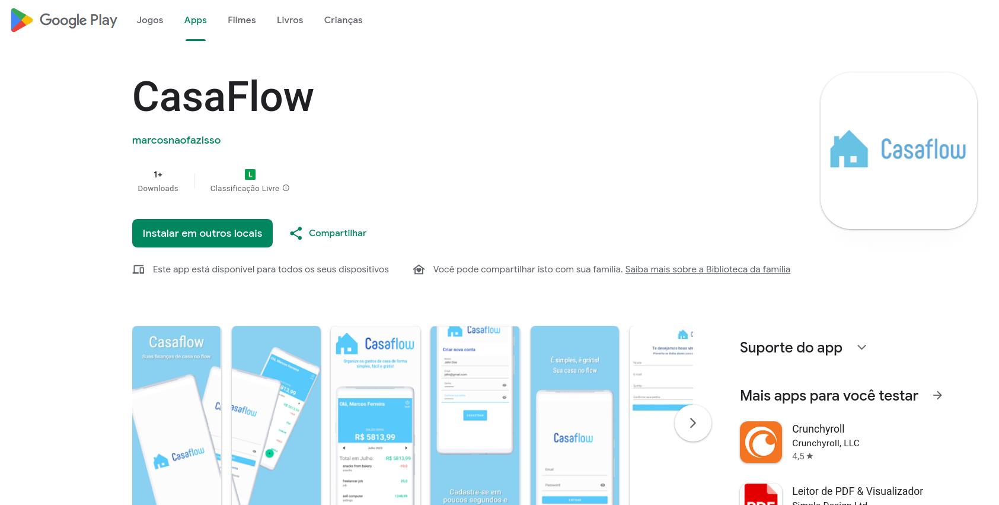

# CasaFlow

This is a landing page for the CasaFlow project - a personal finance app, developed for Android devices, and currently available on the Play Store.

### Developers: 
* [Marcos Vinicius Ferreira](https://github.com/marcosnaofazisso) 

## Goals:
The main goal of the landing page is to guide customers to the Play Store by clicking on the designated button or simply scanning the QR code displayed on the banner. Additionally, a functionality required by Google's guidelines and the Play Store is the option for users to delete their app data through a user-friendly and easily usable request.

# Demo

CasaFlow landing page on web.

This is the CasaFlow page published on the Play Store and can be accessed through the link below:

[Link para CasaFlow no Play Store](https://play.google.com/store/apps/details?id=com.marcosviniciusferreira.casaflow)

If you have any questions, suggestions, or encounter any bugs in the app, feel free to contact me, okay?

## Thank you!

